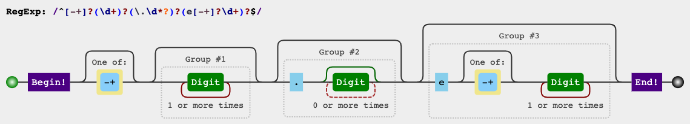
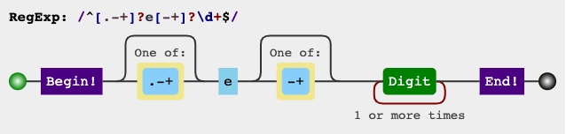

---
tc:
- leetcode
- algorithm
id: 20221020222104_581dba86a92b4ad2
date: "2022-10-20"
aliases:
- 65. 有效数字
---

# 65. 有效数字
```
验证给定的字符串是否可以解释为十进制数字。

例如:

"0"=>true
" 0.1 "=>true
"abc"=>false
"1 a"=>false
"2e10"=>true
" -90e3 "=>true
" 1e"=>false
"e3"=>false
" 6e-1"=>true
" 99e2.5"=>false
"53.5e93"=>true
" --6 "=>false
"-+3"=>false
"95a54e53"=>false

说明:我们有意将问题陈述地比较模糊。在实现代码之前，你应当事先思考所有可能的情况。这里给出一份可能存在于有效十进制数字中的字符列表：

数字 0-9
指数 - "e"
正/负号 - "+"/"-"
小数点 - "."
当然，在输入中，这些字符的上下文也很重要。

更新于 2015-02-10:
C++函数的形式已经更新了。如果你仍然看见你的函数接收const char * 类型的参数，请点击重载按钮重置你的代码。


来源：力扣（LeetCode）
链接：https://leetcode-cn.com/problems/valid-number
著作权归领扣网络所有。商业转载请联系官方授权，非商业转载请注明出处。
```

## 愚笨的思考

第一反应是用正则, 所以决定正则搞起. 

通过测试用例看, 应该正则可能搞不定. 

第一个正则 `^[\-\+]?(\d+)?(\.\d*?)?(e[\-\+]?\d+)?$`





`[\-\+]?`只能出现一次的正负标记

`(\d+)?`整数部分

`(\.\d*?)?`小数部分 

`(e[\-\+]?\d+)?`幂数部分, 科学计数法中幂次部分不能有小数

这个正则无法处理`e...`, `.e...`,`-e...`,`+e...`这种情况, 又补充了第二个正则来解决这种情况

第二个正则 `^[\.\-\+]?e[\-\+]?\d+$`



`[\.\-\+]?` 以`. - +`开头

`e[\-\+]?\d+` 的幂数部分

我写的这两个正则, 加上`-.`和`+.`是可以通过leetcode-cn的全部测试用例的.

实际上是不是正确就不确定了.

