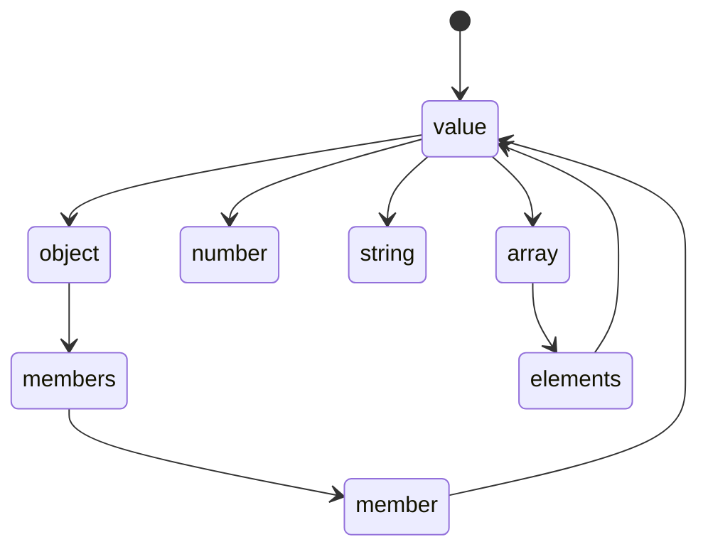

# json-parser

git: [Barenboim/json-parser: JSON parser in ANSI-C](https://github.com/barenboim/json-parser)

关于 json 的相关介绍 [JSON](https://www.json.org/json-en.html)

## 简介

```
───────────────────────────────────────────────────────────────────────────────
Language                 Files     Lines   Blanks  Comments     Code Complexity
───────────────────────────────────────────────────────────────────────────────
C                            4      1503      214        38     1251        254
C Header                     3       540       68       194      278         25
JSON                         1         1        0         0        1          0
License                      1       201       32         0      169          0
Makefile                     1        20        5         0       15          0
Markdown                     1       132       17         0      115          0
───────────────────────────────────────────────────────────────────────────────
Total                       11      2397      336       232     1829        279
───────────────────────────────────────────────────────────────────────────────
Estimated Cost to Develop $50,923
Estimated Schedule Effort 4.436531 months
Estimated People Required 1.019746
───────────────────────────────────────────────────────────────────────────────
Processed 57844 bytes, 0.058 megabytes (SI)
───────────────────────────────────────────────────────────────────────────────
```

[sogou/workflow](https://github.com/sogou/workflow) 的附属项目, 用来进行 json 解析

workflow 项目并没有依赖 json-parse 项目, 而是直接把代码粘贴进去的, diff 结果看只有版权信息不一致. 不知道作者为啥要自己写, 而不是用现成的.

代码中 rbtree 从注释上看是从 linux 里面粘出来的.

实际代码量在 900 行左右. 我没有做过任何 c/c++ 相关的开发, 也就是勉强能读. 这个项目可以独立编译成可执行文件, 进行 json 格式化输出. 主要想看看怎么写一个 json 解析器.

## 源码

从 test.c 可以作为调用的起点.

核心方法在 json_parse.h 文件中进行了定义. 提供了, 解析, 创建, 销毁, 遍历, 查找, 编辑等操作.

核心结构
```go
type __json_value struct {
    json_type int
    value struct {
        str string
        number float64
        object json_object_t
        array json_array_t
    }
}

type __json_member struct {
    lNode  listNode
    tNode  rbNode
    value __json_value
    name  string
}

type __json_object struct {
    head listNode
    root rbNode
    size int
}

type __json_array struct {
    head listNode
    size int
}
```

几个主要解析函数
```go
func __parse_json_member(); 
func __parse_json_object(); 
func __parse_json_members(); 
func __parse_json_value(); 
func __parse_json_elements();
func __parse_json_number();
func __parse_json_string();
func __parse_json_array();
```

解析流程


销毁流程

根据 json_type 调用对应的 destroy 流程, 采用深度优先遍历, 从最深层开始释放, 逐一释放直到全部释放. free 会消耗性能吗?

### 有意思的点

1. 使用 #红黑树 和 #列表 作为 object 的核心结构
    1. 红黑树用来快速查找
    2. 列表用来进行遍历, 控制遍历顺序和 json 文本顺序一致
        1. fastjson 就不考虑这个, 一个 hashmap 直接存了, 输出顺序就不确定了.
    3. 链表是循环链表, 所以插入尾部是直接插入第一个元素
        1. 方法名是插入尾部, 然后实际代码是插入头元素前
        2. 以后看到部署项目的代码, 只看方法名不看实现, 看完实现反而导致我没看懂代码.
2. json_value 结构中的 value 不是全部类型, 只包含了 4 种 json 类型; 没有包含 bool 和 null, 这两种类型使用 json_type 来表达
    1. 我可能会选择在 value 中包含所有类型
3. 看代码结构定义通常是定义两次
    1. 定义一个别名 `typedef struct __json_object json_object_t;`
    2. 定一个具体
        ```c
        struct __json_object
        {
        	struct list_head head;
        	struct rb_root root;
        	int size;
        };
        ```
    3. 猜测好处
        1. 看代码整体风格, 所有"`_`"开头的都是内部方法.
        2. 这种写法是为了更好的封装性
            1. 我可能反而不会这么做, 基础结构公开是比较好, 反正都要用这个结构, 没有必要藏起来
4. `char name[1]` 进行定义, 这个写法我理解是只能有一个长度只有 1 的数组. 但实际上可以做指针操作继续`++` 这不会报错吗?
    1. 发现在创建结构的时候, 需要优先计算出 name 长度, 申请内存的时候申请大一点
        1. `malloc(offsetof(json_member_t, name) + ret + 1);`
    2. 为啥创建的时候不创建 `char name[]` 或者 `const char *` 呢?
        1. `char name[]` 可能 c 不能这么创建
        2. `const char *` 这个是在看 [[stupid-self/transcribe-code/tinyhttpd/README]] 中了到的.
        3. 可能是这样创建出来的内存更紧凑
        4. 或者为了方便释放

### 一些吐槽

1. c 需要销毁对象, 果然不习惯.
    1. 解析过程中出现失败就要开始释放
    2. 习惯了有 gc 的语言, 失败就直接结束就好了, 从来不手动释放这些结构
2. 还是不习惯, c 语言用入参作为出参这种习惯
    1. java 选择的是 exception 向上抛出来实现异常处理
    2. golang 是通过多返回值来实现异常处理
3. 指针操作看不懂, 能知道的大概含义, 但不知道这么写是不是对的. 
    1. `const + 指针`的组合也很困惑
