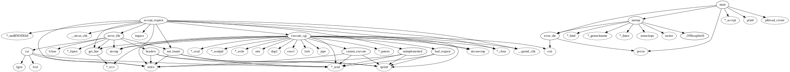
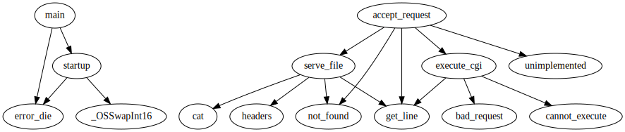

# Tintyhttpd

源码地址: [EZLippi/Tinyhttpd: Tinyhttpd](https://github.com/EZLippi/Tinyhttpd)

源码下载: [tiny-httpd - Browse /tiny-httpd at SourceForge.net](https://sourceforge.net/projects/tiny-httpd/files/tiny-httpd/)

源码很少, 虽然是 C 的, 但看懂问题应该不大.

## 代码基本情况

### 行数统计

代码基本情况, 统计工具[coca](https://github.com/inherd/coca)
```
───────────────────────────────────────────────────────────────────────────────
Language                 Files     Lines   Blanks  Comments     Code Complexity
───────────────────────────────────────────────────────────────────────────────
C                            2       549       48        91      410         85
HTML                         1        11        0         0       11          0
License                      1       674      121         0      553          0
Makefile                     1         9        1         0        8          0
Markdown                     1       101       14         0       87          0
───────────────────────────────────────────────────────────────────────────────
Total                        6      1344      184        91     1069         85
───────────────────────────────────────────────────────────────────────────────
Estimated Cost to Develop $28,974
Estimated Schedule Effort 3.580819 months
Estimated People Required 0.718878
───────────────────────────────────────────────────────────────────────────────
Processed 59346 bytes, 0.059 megabytes (SI)
───────────────────────────────────────────────────────────────────────────────
```

### call graph

方法调用图, 使用工具 [cally](https://github.com/chaudron/cally), 工具依赖 `gcc`和`graphviz`

完整调用图


内部函数调用图



## 辅助网站

* [The Linux man-pages project](https://www.kernel.org/doc/man-pages/) 库含义
* [RFC 1945: Hypertext Transfer Protocol -- HTTP/1.0](https://www.rfc-editor.org/rfc/rfc1945.html)

## 无法理解和对应解释

作为一个没有经过 C/C++ 洗礼的程序员, 无法理解其中的书写方式和设计方案.

1. C 语言为啥用通过修改入参实现对象的修改
    1. 大概和 C 语言本身没有错误处理机制
    2. 内存分配有关
2. 为啥要的定义`char[1024]`但不写满\(尽可能满一些, 或者至少写一半\)就调用`send`方法.
    1. 主要针对的是 400, 404, 500 这几段处理, 写到`\r\n`就发送了.
    2. 猜测原因
        1. 一种习惯
        2. RFC 文档中有某种隐含规定, 但我没看出来
3. `get_line` 中的 `recv` 调用一次只读取一个字符是不是有点少了.
    1. 后边想了一下, 可能真的需要一个一读取
    2. 因为是流, 消费超过`\r\n`数据没有办法二次消费.
        * 只能自己进行缓存
        * 这代码复杂度不可想象
    3. 每一次消费都使用 `MSG_PEEK` 效果还没有一个一个来的好.


## 代码流程
